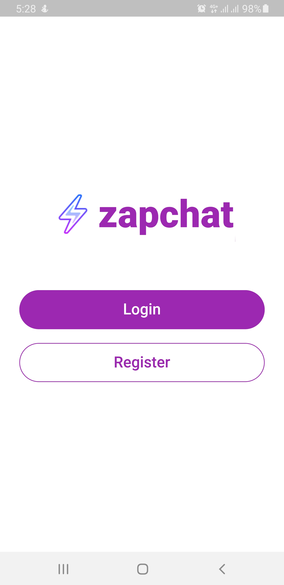
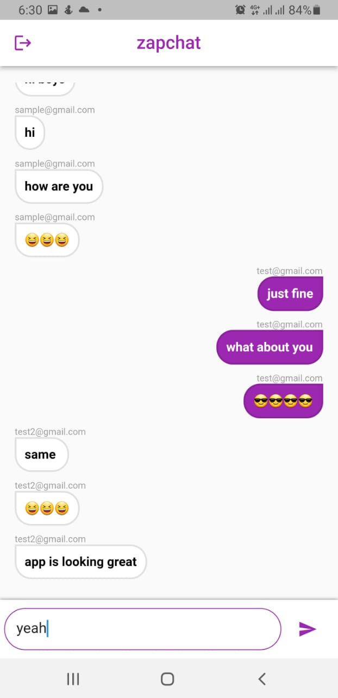
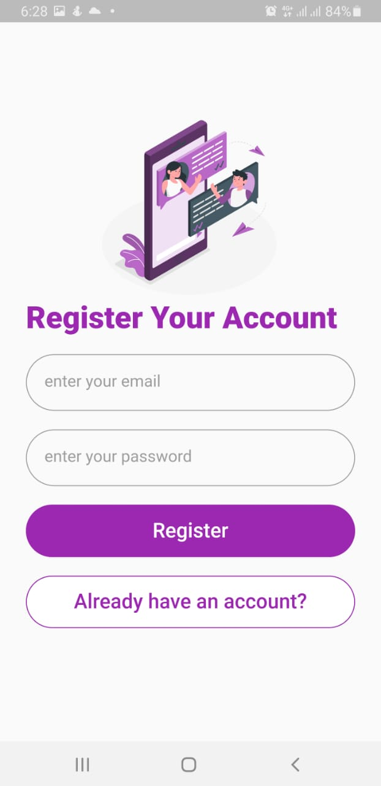

[# zapchat

A Flutter Chat App with animations and firebase login/signup and cloud firestore to save realtime messages. With simple and easy UI and animations and text effects.

## Table of Contents
- [Introduction](#introduction)
- [Demo](#demo)
- [Features](#features)
- [Packages and Dependencies](#packages-and-dependencies)

## Screenshots

## Introduction

This app uses Firebase Authentication using Email/Pass and Firestore to save chats. It was created during my learning phase to learn Streams, Animations, and Firebase.

## Features

- Simple UI
- Firebase Authentication
- Only Group Chat
- Firestore Storage

## Packages and Dependencies
- [firebase_core](https://pub.dev/packages/firebase_core)
- [firebase_auth](https://pub.dev/packages/firebase_auth)
- [cloud_firestore](https://pub.dev/packages/cloud_firestore)
- [flutter_animation_progress_bar](https://pub.dev/packages/flutter_animation_progress_bar)
- [animated_text_kit](https://pub.dev/packages/animated_text_kit)
- [modal_progress_hud_nsn](https://pub.dev/packages/modal_progress_hud_nsn)]()
